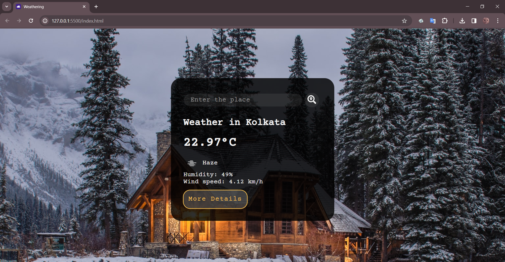
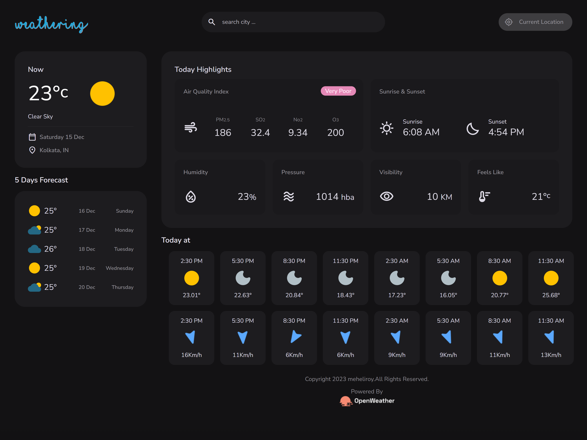
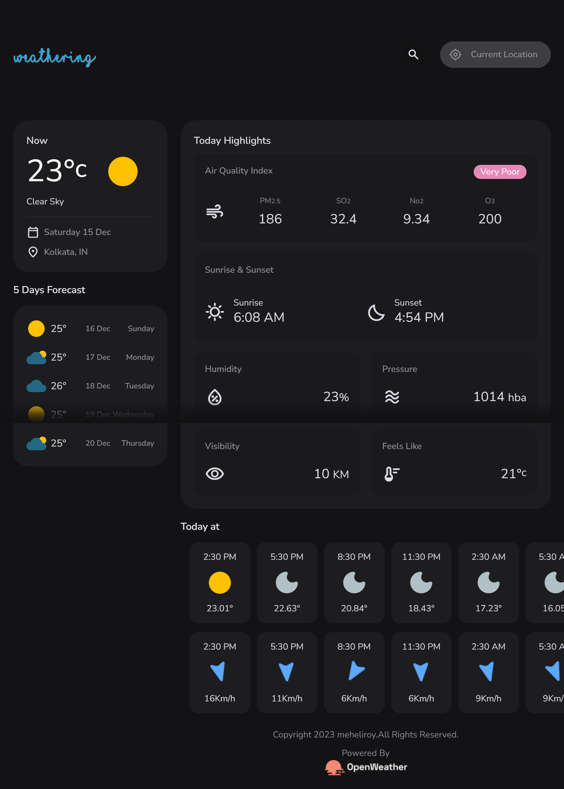
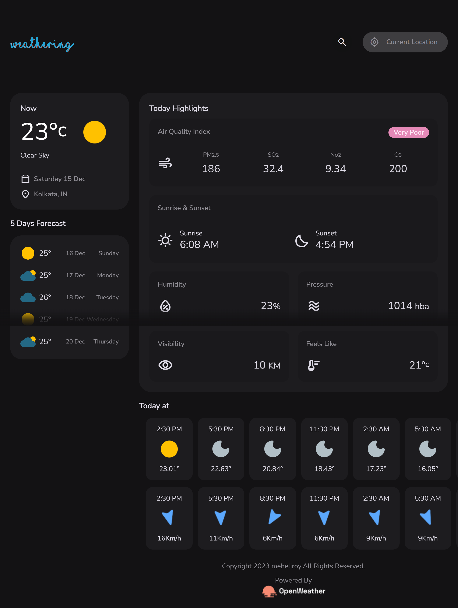
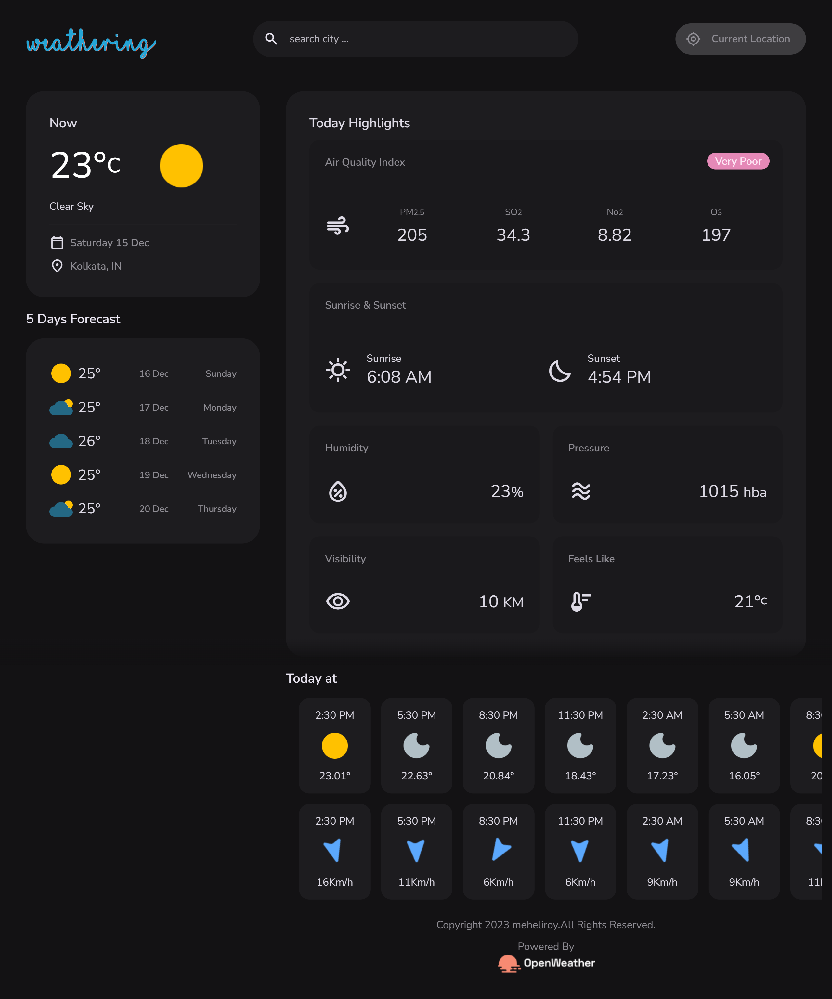

# Weathering Documentation

Have a look !!!!
[Weathering](https://mehelir.github.io/Weathering/)

.png)

## Introduction

Weathering is a web application that provides real-time weather information. It offers features such as viewing the current weather, a 5-day forecast, wind speed, temperature for the current day, sunrise and sunset times, air quality, humidity, visibility, feels like temperature, and atmospheric pressure.

You can experience a glimpse os the place your searched for within seconds. 

The application is developed using HTML, CSS, and JavaScript, and it utilizes the OpenWeather API to fetch weather data for different cities around the world.

## Table of Contents

1. [Project Overview](#project-overview)
2. [Getting Started](#getting-started)
    - [Prerequisites](#prerequisites)
    - [Installation](#installation)
3. [Project Structure](#project-structure)
4. [HTML](#html)
    - [index.html](#index.html)
    - [more.html](#morehtml)
5. [CSS](#css)
    - [style.css](#style.css)
6. [JavaScript](#javascript)
    - [script.js](#script.js)
    - [api.js](#api.js)
    - [app.js](#app.js)
    - [module.js](#module.js)
    - [route.js](#route.js)
7. [Functionality](#functionality)
8. [Screenshots](#screenshots)
9. [Contributing](#contributing)
10. [License](#license)

## Project Overview

The Weather Website is a user-friendly and responsive web application that allows users to search for cities and get detailed weather information. The data is presented in a visually appealing format with easy-to-understand icons and labels.

Key Features:
- View current weather conditions (temperature, weather icon, and description).
- Provide information about humidity, visibility, and wind speed, feels like temperature, and atmospheric pressure.
- Get a 5-day weather forecast.
- Display wind speed and temperature every 2 hours for the current day.
- Show sunrise and sunset times for the selected city.

## Getting Started

### Prerequisites

- Modern web browser (Chrome, Firefox, Safari, etc.).
- Internet connection to fetch weather data from the OpenWeather API.

### Installation

1. Clone the repository or download the project files to your local machine.
2. Open `index.html` in your web browser.

## Project Structure

The project is organized into multiple files for better code organization and separation of concerns:

- `index.html`: The main HTML file that contains the user interface.
- `style.css`: The CSS file that defines the styling for the web application.
- `script.js`: Contains functions to interact with the OpenWeather API and contains main application logic.
- `api.js`: Contains functions to interact with the OpenWeather API.
- `module.js`: Contains utility functions related to weather data conversion and calculations.
- `app.js`: Contains the main application logic, including event handling and rendering.
- `route.js`: Defines the application routes and handles URL hash changes.

## HTML

Defines the basic layout of the app, including a search bar, a button for initiating weather searches, and a display area for weather information .

### index.html

The main HTML file contains the structure of the Weather Website.

### more.html

It consists of different sections, including a search bar, current weather display, forecast section, and additional weather details. The page is designed to be responsive and adapts to different screen sizes.

## CSS

### style.css

Likely linked through style.css, it customizes the appearance of various elements like the search bar, weather information display, and overall layout of the app.

The `style.css` file contains all the CSS styles used to create a visually appealing and user-friendly interface. It defines global variables, reset styles, and custom styles for various components like buttons, cards, headers, and footers. The CSS is organized using class selectors for specific components and follows a mobile-first approach with media queries for responsive design.

## JavaScript

### script.js

This script is likely responsible for handling user interactions, fetching weather data, and dynamically updating the displayed weather information.

### api.js

The `api.js` file contains functions to interact with the OpenWeather API. It includes functions to fetch weather data based on city names and coordinates using asynchronous JavaScript (async/await) and the Fetch API. The API key required for accessing the OpenWeather API is stored as a constant.

### app.js

The `app.js` file contains the main application logic. It defines functions to update the weather information on the user interface based on the data fetched from the API. This file handles event listeners for user interactions, such as searching for a city, updating the UI for current weather and forecast, and displaying error messages when necessary.

### module.js

The `module.js` file defines utility functions related to weather data conversion and calculations. It includes functions to convert temperature units from Kelvin to Celsius and Fahrenheit, convert wind speed units, and calculate air quality index (AQI) level and its corresponding message.

### route.js

The `route.js` file manages the application's routing system. It defines routes for different sections of the website and handles URL hash changes. The routes are associated with specific functions in `app.js` to render the appropriate content based on the user's actions.

## Functionality

- Users can search for a city to view its weather information.
- The application fetches real-time weather data from the OpenWeather API.
- The current weather section displays the temperature, weather icon, and description.
- The 5-day forecast shows the weather conditions for the next five days.
- The hourly forecast provides wind speed and temperature details for the current day.
- Sunrise and sunset times are displayed for the selected city.
- The application is responsive and adapts to different screen sizes.
- Additional weather details, including air quality, humidity, visibility, feels like temperature, and atmospheric pressure, are shown.

## Screenshots

### Home Page

### More Details Page

#### 1024x768

#### 1080x768

#### 1280x1024

#### iPad Mini

#### iPad Pro

#### iPhone

### Samsung Galaxy S20 Ultra

### Default Page
.png)

### Search Page
.png)
.png)

## Contributing

We welcome contributions to enhance the project! If you find any issues or have ideas for improvements, please don't hesitate to report them through GitHub issues. You can also suggest enhancements or submit pull requests to help make this project even better.

## License

This project is distributed under the MIT License. You can find the full text of the license in the [LICENSE](https://github.com/MeheliR/Weathering/blob/main/LICENSE) file.
